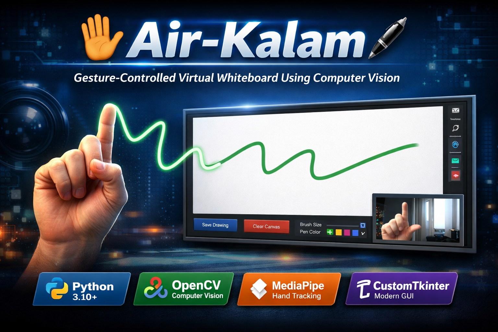

<p align="center">
  
</p>

# ✋🖋️ Air-Kalam (React Web App)

Gesture-controlled virtual whiteboard built with **React + Vite + MediaPipe**.

## Features

- Real-time right-hand tracking in the browser
- Air drawing with index finger gesture
- Pause gesture, clear gesture, and pinky eraser gesture
- Brush size and pen color controls
- Save drawing as PNG
- Dark/Light theme toggle
- Live camera preview

## Gesture Controls

| Gesture | Action |
|---|---|
| ☝️ Right-hand index finger up | Draw |
| ✌️ Right-hand index + middle finger | Pause drawing |
| ✋ Right-hand all fingers open | Clear canvas |
| 🤙 Right-hand pinky finger only | Eraser mode |

## Tech Stack

- React
- Vite
- MediaPipe Tasks Vision (`@mediapipe/tasks-vision`)

## Run Locally

```bash
npm install
npm run dev
```

Open the URL shown by Vite (usually `http://localhost:5173`).

## Build

```bash
npm run build
npm run preview
```

## Project Structure

```text
Air-Kalam-/
├── src/
│   ├── App.jsx
│   ├── App.css
│   ├── index.css
│   └── main.jsx
├── asset/
├── package.json
├── index.html
└── README.md
```

## Notes

- Browser camera permission is required.
- Gesture quality depends on lighting and webcam quality.
